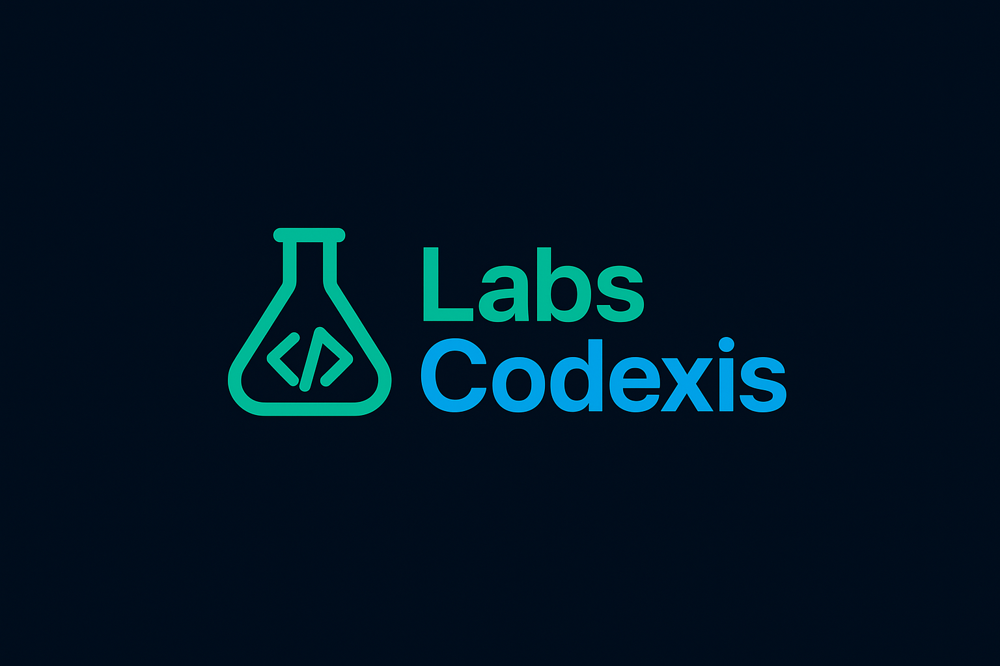

<!-- Logo da empresa -->

<!-- Certifique-se de que o arquivo 'logoOficial.png' está na raiz do seu repositório! -->

<h1 align="center">✨ LabsCodexis: Onde a Criatividade Encontra o Código</h1>

Laboratório criativo de tecnologia, fundado por <b>Matheus Gonçalves</b>, dedicado a construir soluções digitais inovadoras, futuristas e acessíveis.

<!-- BADGE DE STATUS CORRIGIDO -->

🎯 Nossa Missão & Visão

A LabsCodexis nasceu com a missão de unir criatividade e código para gerar impacto significativo no mundo digital. Somos movidos pela inovação e pela excelência técnica.

<ul>
<li><strong>Design Futurista:</strong> Entregamos projetos que não apenas funcionam, mas que ditam tendências de usabilidade e estética.</li>
<li><strong>Tecnologia de Ponta:</strong> Utilizamos as ferramentas mais robustas e eficientes para garantir soluções rápidas e escaláveis.</li>
<li><strong>Impacto Acessível:</strong> Focamos em construir o futuro digital de forma que seja útil e acessível para todos.</li>
</ul>

🛠️ Stack Tecnológica (Nossas Ferramentas)
Nossa força reside na diversidade e domínio das tecnologias que impulsionam o mundo digital.

<!-- Ícones das tecnologias originais -->

📊 Performance no GitHub
Confira um pouco da nossa atividade e as linguagens que mais desenvolvemos.

<!-- ESTATÍSTICAS CORRIGIDAS E FUNCIONAIS com BG #0D1117 -->

📞 Contato & Redes Sociais
Queremos construir algo incrível com você! Fale conosco:

<!-- Badges de contato corrigidos e estilizados -->

<h3>
Desenvolvido com dedicação por <b>Matheus Gonçalves</b> e a equipe LabsCodexis.
</h3>
